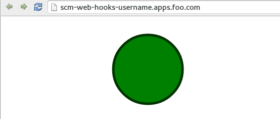
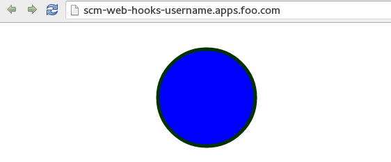

#**Lab 11: Rollback Applications**

In this lab we will see how we can rollback an application in OpenShift quickly without switching to an older version of the source code in SCM. We will:

1. Use the same app we deployed in Lab 10. If you haven't, please complete that Lab first.
2. Rollback the application using the OpenShift v3 command "rollback"

**Step 1: Check application health status**

Run:

    $ oc get pods
    NAME                    READY     STATUS      RESTARTS   AGE
    scm-web-hooks-1-build   0/1       Completed   0          4m
    scm-web-hooks-2-build   0/1       Completed   0          1m
    scm-web-hooks-3-4ai3m   1/1       Running     0          40s
    scm-web-hooks-3-build   0/1       Completed   0          1m

Inspecting the output of the above command we can see that we have a single
replica of the previously deployed application running.

We can also see that previously three pods were used to build the application.
OpenShift will create and docker deploy a pod per deployment. This tells us that
we currently have two versions of the application.

You can also use:

    $ oc get dc
    NAME            TRIGGERS                    LATEST
    scm-web-hooks   ConfigChange, ImageChange   3

The latest and active version for the application is **3**

If we display the application in the browser we see:

**Step 2: Rollback the application**

Using the previous command we ran to retrieve the deployment configuration, we will revert or rollback to version 1.

    $ oc rollback scm-web-hooks --to-version=1
    #4 rolled back to scm-web-hooks-1

If we re-run the command to list the build configurations, we now see:

    $ oc get dc
    NAME            TRIGGERS                    LATEST VERSION
    scm-web-hooks   ConfigChange, ImageChange   4

So OpenShift has rolled back the application to version 1 and created a new build configuration.

Reloading the application now displays:

## Summary

We have seen that rolling back to previous deployments is easy when using immutable container based deployments that
are versioned