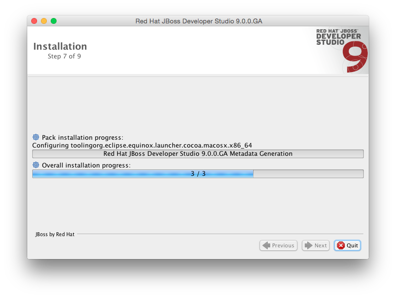
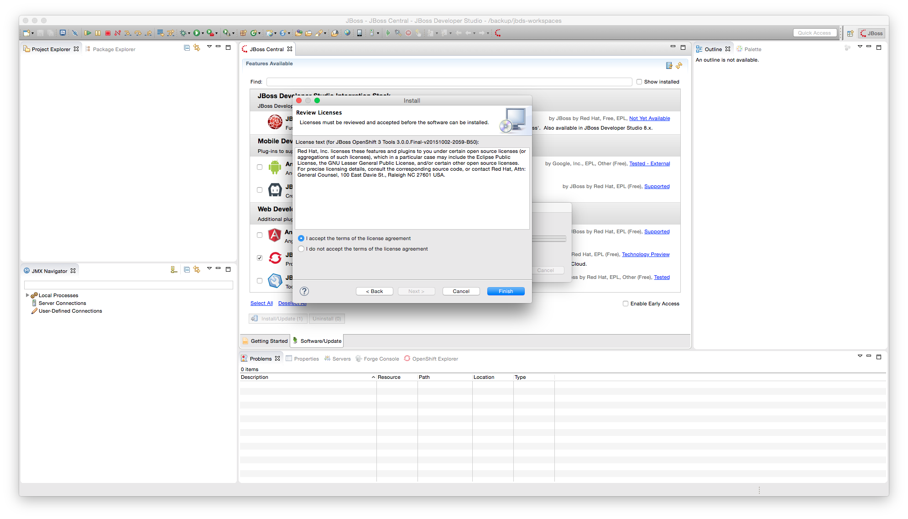
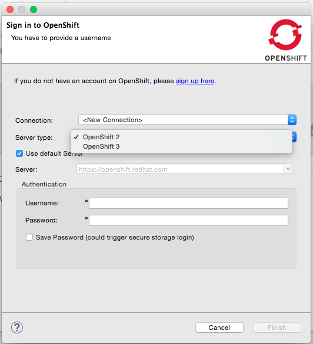
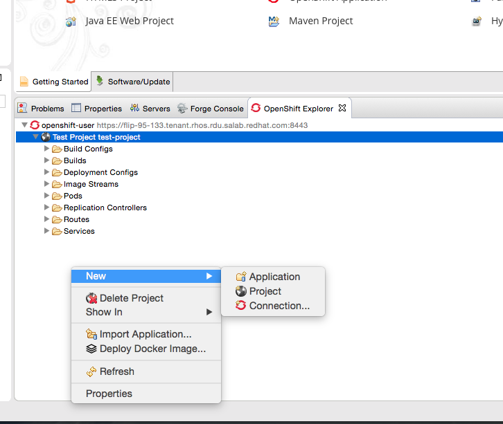

#**Lab 13: Installing the JBoss Developer Studio Plugin**

**Step 1: Download and install JBoss Studio**

Download the latest JBoss Developer studio from:

    http://www.jboss.org/products/devstudio/download

**Step 2: Install OpenShift Plugin**

1. Open JBoss Studio.
2. Navigate to JBoss Central and select "Software/Update" tab
3. Look for the OpenShift V3 tools
4. Select it and install. Accept license agreement. It may warn you about unsigned content. Ignore it.

**Step 3: Configure OpenShift v3 Plugin**

1. At the bottom of your IDE, expand the OpenShift explorer panel.
2. Add a new connection.
3. From the “Server type” dropdown box, select OpenShift 3.
4. For the Server URL, ensure you add port 8443 if you are not using the default server FQDN.
5. Select the authentication mechanism.
6. Provide the username and password.
7. Click Finish

**Step 4: Verify your connection**

1. At this point, you will be able to see any existing projects for which the provider username and password have access to.
2. You can also see a number of types, such as deployment configurations, services routes, etc...