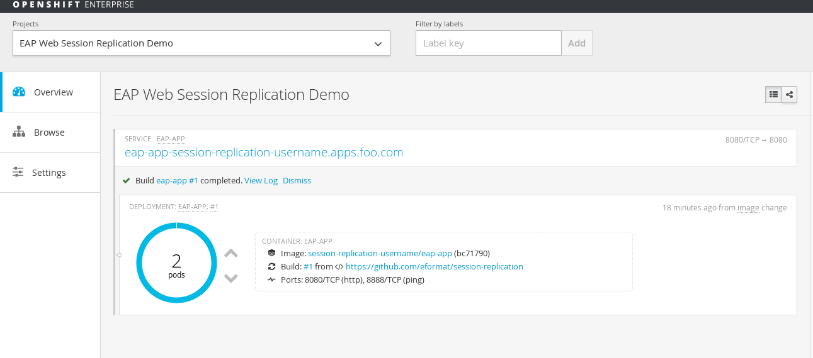
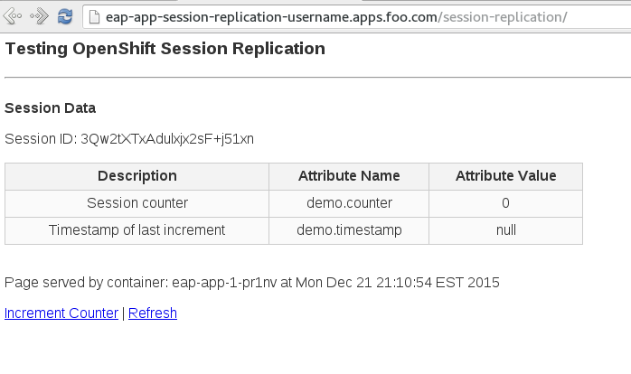
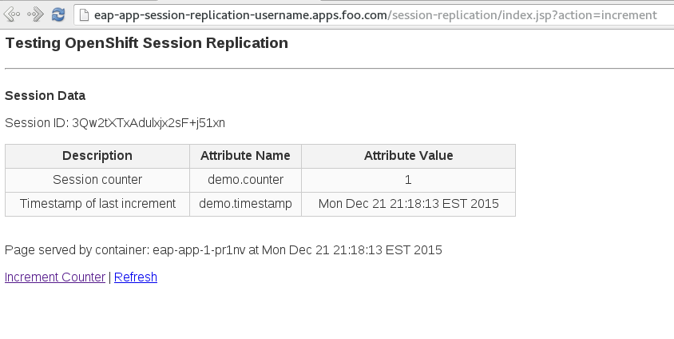
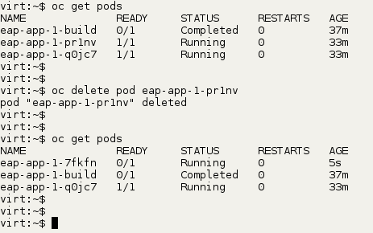
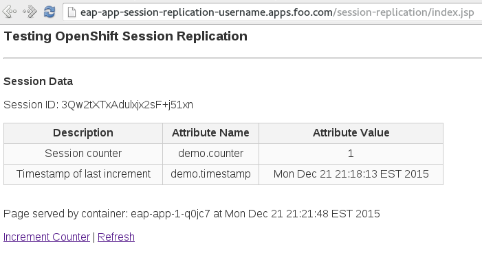

#**Lab 23: Deploy OSE on AWS**

TBD

demonstrates session replication across the cluster.

This is a very common use case for enterprise web applications that require user sessions to remain alive even if the server
they are being hosted on is restarted or suffers a fault.

Documentation for JBoss EAP Clustering can be found [here](http://www.redhat.com/en/resources/jboss-eap-6-clustering).

To enable session clustering in your web application, EAP has to be configured (done by default in OpenShift) as well as adding the
following to your **src/main/webapp/WEB-INF/web.xml**:

     <distributable/>

There are several major functionality differences in the OpenShift JBoss EAP xPaaS image that are documented
[here](https://docs.openshift.com/enterprise/3.1/using_images/xpaas_images/eap.html#comparing-the-jboss-eap-xpaas-image-to-the-regular-release-of-jboss-eap).

The main difference for clustering being that `domain` mode is not supported - OpenShift controls the creation and distribution of applications in the containers.

**Step 1 - Create Project**

Create a project using CLI or using the Web Console

    $ oc new-project session-replication-username --display-name="EAP Web Session Replication Demo" --description="EAP Web Session Replication Demo"

**Remember** to substitute the username.

**Step 2: Provide EAP Access to Kubernetes API**

JBoss EAP Clustering is achieved through one of two discovery mechanisms: Kubernetes or DNS.

This is done by configuring the JGroups protocol stack in [standalone-openshift.xml](https://github.com/eformat/session-replication/blob/master/configuration/standalone-openshift.xml)
with either the

    <openshift.KUBE_PING/>

    or

    <openshift.DNS_PING/>

elements. Out of the box, **KUBE_PING** is the pre-configured and supported protocol.

Authorization must be granted to the service account the pod is running under to be allowed to access Kubernetes' REST api.

This is done on the command line from within your project:

    $ oc policy add-role-to-user view system:serviceaccount:$(oc project -q):default -n $(oc project -q)

Note: it is also posible to run EAP using a service account e.g. `eap-service-account` in which case the policy would be:

    $ oc policy add-role-to-user view system:serviceaccount:$(oc project -q):eap-service-account -n $(oc project -q)

**Step 3 - Create the applicaton using STI and JBoss EAP template**

The application source code is in [github](https://github.com/eformat/session-replication). It contains a simple JSP web
application and a standalone openshift EAP configutaiton file.

Lets create our application from this template:

    $ oc new-app --template=eap64-basic-s2i -p APPLICATION_NAME=eap-app,SOURCE_REPOSITORY_URL=https://github.com/eformat/session-replication,SOURCE_REPOSITORY_REF='master',CONTEXT_DIR='/' -l name=eap-app

We can also scale the deployment configuration so that two pods will running our EAP application:

    $ oc scale dc/eap-app --replicas=2

**Step 4 - Check application build and deploy**

Wait for the application to build and deploy. You can follow the build logs either in the web console or by using the CLI

Once the build and deployment has successfully completed, the overview should resemble:

If you look at the running pod's logs, you should be able to identify the JGroups cluster members being added `Received new cluster view:`

**Step 5 - Test**

Browse to the application itself, a route should have been created - append **session-replication/** to the route URL:

The web application displays the following information:

- Session ID
- Session `counter` and `timestamp` (these are variables stored in the session that are replicated)
- The container name that the web page and session is being hosted from

Now, select the **Increment Counter** link:

You should see the session variables being set.

To test that the session is being replicated OK, we are going to kill the running container e.g. in this example

    $ oc delete pod eap-app-1-pr1nv

You should see on that the replication controller immediately starts another pod to keep the replica count at the desired level:

Now if you hit the **Refresh** link in the web page, you will see (after a short pause) the **same** web session being served
up from a new container

The `Session ID` and session attributes, values remain the same and the container serving the page has changed.

##Summary##

Congratulations ! You have successfully:

- built and deployed a cluster JBoss EAP web application
- tested web session replication in a fail-over scenario

